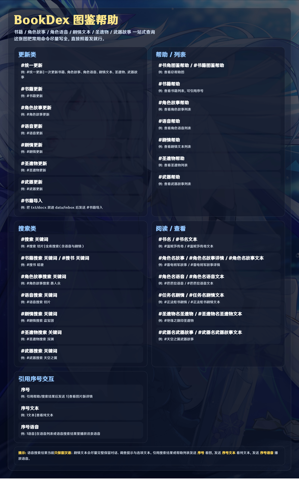

# 书籍角色文本图鉴（bookdex-plugin）



## 安装方式

在 Yunzai 主目录执行：

```bash
git clone https://github.com/KexinyingLife/bookdex-plugin.git ./plugins/bookdex-plugin
```

依赖安装（推荐，进入插件目录执行，适配所有用户环境）：

```bash
cd plugins/bookdex-plugin
pnpm i
```

---

## 首次使用（必须先全量拉取）

首次下载后先执行：

```text
#统一更新
```

该命令会一次更新：书籍、角色故事、角色语音、剧情文本、圣遗物、武器故事。

---

## 自动拉取机制（42天周期）

插件内置了“42天一个周期”的自动更新窗口：

- 每天会检查一次窗口
- 在每个 42 天周期的第 **1~5 天**（不含第 0 天）自动执行统一更新
- 你仍可随时手动执行 `#统一更新`

---

## 命令总览（已实现）

### 更新类

- `#统一更新`
- `#书籍更新`
- `#角色故事更新`
- `#语音更新`
- `#剧情更新`
- `#圣遗物更新`
- `#武器更新`
- `#书籍导入`

### 帮助/列表

- `#书角图鉴帮助` / `#书籍图鉴帮助`（总帮助入口）
- `#书籍帮助`
- `#角色故事帮助`
- `#语音帮助`
- `#剧情帮助`
- `#圣遗物帮助`
- `#武器帮助`

### 搜索

- `#搜索 关键词`（全库）
- `#书籍搜索 关键词`
- `#搜书 关键词`
- `#角色故事搜索 关键词`
- `#语音搜索 关键词`
- `#剧情搜索 关键词`
- `#圣遗物搜索 关键词`
- `#武器搜索 关键词`

### 阅读

- `#书名`
- `#书名文本`
- `#角色名故事`
- `#角色名故事详情`
- `#角色名故事文本`
- `#角色名语音`
- `#角色名语音文本`
- `#任务名剧情`
- `#任务名剧情文本`
- `#圣遗物名圣遗物`
- `#圣遗物名圣遗物文本`
- `#武器名武器故事`
- `#武器名武器故事文本`
- `序号`（引用帮助/搜索结果时）
- `序号文本`（引用帮助/搜索结果时）
- `序号语音`（语音搜索结果 / 语音列表中播放语音）

---

## 数据来源（米游社观测枢）

本插件数据抓取使用米游社观测枢相关接口：

- 列表入口（selector）  
  `https://act-api-takumi.mihoyo.com/common/blackboard/ys_obc/v1/content/selector`
- 词条详情（entry_page）  
  `https://act-api-takumi-static.mihoyo.com/hoyowiki/genshin/wapi/entry_page`

频道参数：

- `channel_id=68`：书籍
- `channel_id=25`：角色故事 / 角色语音（语音数据来自角色词条内 `role_voice` 模块）
- `channel_id=43`：剧情文本（主要提取词条中的“剧情对话”模块）
- `channel_id=218`：圣遗物
- `channel_id=5`：武器

---

## 使用样例

```text
#统一更新
#书籍帮助
#温妮莎传奇
#温妮莎传奇文本
#雷电将军故事
#雷电将军故事详情
#雷电将军语音
#语音搜索 治愈
#正法炬书剧情
#剧情搜索 盗宝团
#圣遗物帮助
#武器帮助
#搜索 深渊
#角色故事搜索 旅人
#武器搜索 天空之翼
```